# Eathos — AI Nutritionist from a Fridge Scan

[Watch the Demo Video](https://github.com/user-attachments/assets/29aab976-ed9b-42a1-9278-96b9a7df43d8)

## Overview

Eathos turns a single fridge photo into a personalized, waste-reducing meal plan. It identifies ingredients, estimates freshness, reasons over nutrition and expiry, and recommends recipes tailored to your household. **AI proposes, humans confirm.**

## The Problem

Food waste often starts with a simple daily question: *What can I make with what I already have?*

Households struggle because:
- People don't know what's expiring soon
- Meal planning starts from browsing recipes, not real inventory
- Families often have mixed dietary needs, ages, and health constraints

## Our Solution

Eathos uses a multi-agent AI pipeline built on **Google ADK** and **Gemini** to turn one fridge scan into practical, personalized meal plans.

- Detects inventory with confidence and freshness signals using Gemini vision
- Lets users confirm or edit detections before planning (human-in-the-loop)
- Prioritizes soon-to-expire ingredients to reduce food waste
- Generates recipes with full nutritional breakdowns
- Produces an AI-generated food image of the suggested dish
- Tracks what's left after cooking via automatic ingredient deduction
- Supports a standalone nutritionist chat for open-ended nutrition questions

## How It Works

1. **Scan** — Upload a fridge or pantry photo
2. **Review** — Confirm or edit the detected inventory
3. **Plan** — Multi-agent pipeline reasons across ingredients, nutrition, and constraints
4. **Decide** — Accept a recipe or reject and regenerate (up to 3 attempts, then free text input)
5. **Cook** — Get step-by-step instructions, nutritional info, and an AI-generated dish image

---

## Architecture



### Project Structure

```
eathos/
├── frontend/               React + Vite UI
│   └── src/
│       ├── App.jsx           Root component + routing
│       ├── api.js            Axios client — all backend calls
│       └── components/       One component per screen / feature
└── backend/
    ├── app.py              FastAPI server — REST endpoints + static file mounts
    ├── agent.py            ADK entry point — exports root_agent
    ├── agents/
    │   ├── orchestrator.py   FridgeRecipeOrchestrator (BaseAgent)
    │   ├── food_analyzer.py  FoodAnalyzerAgent (LlmAgent, Gemini vision)
    │   ├── nutritionist.py   NutritionistAgent (LlmAgent, recipe generation)
    │   └── shopping_agent.py ShoppingAgent (post-MVP stub)
    ├── tools/
    │   ├── inventory_tools.py  FunctionTools: sync, deduct, add, get inventory
    │   ├── image_tools.py      FunctionTool: Gemini image generation (3-model cascade)
    │   └── dietary_tools.py    FunctionTools: dietary preference CRUD
    ├── models/
    │   ├── inventory.py    Pydantic: DetectedItem, FoodAnalyzerOutput
    │   ├── recipe.py       Pydantic: RecipeOutput, Ingredient, NutritionInfo
    │   └── shopping.py     Pydantic: ShoppingList
    └── state/
        └── session_store.py    In-memory session state helpers (MVP)
```

### Agent Pipeline

The core flow is a phase-based state machine managed by `FridgeRecipeOrchestrator`. Two human-in-the-loop pause points (`return` inside `_run_async_impl`) prevent the pipeline from running to completion without user input.

| Phase | Agent / Tool | What happens |
|-------|-------------|--------------|
| `start` | `FoodAnalyzerAgent` | Gemini vision scans fridge image → structured `DetectedItem` list with confidence + freshness |
| `start` | `sync_inventory_tool` | Merges detections against existing in-memory inventory; flags items not seen as `UNCERTAIN` |
| ⏸ `review_inventory` | **Human checkpoint** | User reviews/edits inventory and sets dietary preferences |
| `generate_recipe` | `NutritionistAgent` | Generates recipe prioritizing expiring items, injects `{inventory}`, `{dietary_preferences}`, `{rejected_recipes}` via ADK state templating |
| ⏸ `review_recipe` | **Human checkpoint** | User accepts or rejects recipe (up to 3 rejects before free text input) |
| `accept_recipe` | `generate_food_image_tool` | 3-model cascade: `gemini-2.0-flash-exp-image-generation` → `gemini-2.5-flash-image` → `imagen-4.0` → Unsplash fallback |
| `accept_recipe` | `deduct_ingredients_tool` | Subtracts used ingredients from the in-memory inventory store |

### FastAPI REST Endpoints

| Method | Path | Description |
|--------|------|-------------|
| `POST` | `/api/analyze` | Upload fridge image; creates a new ADK session and runs Phase 1 |
| `POST` | `/api/action` | Send user action: `confirm_inventory`, `accept_recipe`, `reject_recipe`, `free_input` |
| `GET` | `/api/inventory/{session_id}` | Fetch current inventory + fridge image URL for a session |
| `POST` | `/api/session/new` | Create a blank ADK session (used by NutritionistChat before any scan) |
| `POST` | `/api/chat` | Standalone nutritionist chat — direct `gemini-3.1-pro-preview` call with full message history |
| `POST` | `/api/recipe/generate` | Generate a recipe from an inventory list without starting a session |

Static file mounts:
- `/images/*` → `backend/generated_images/` (AI-generated dish photos)
- `/uploads/*` → `backend/uploads/` (user-uploaded fridge photos, named by `session_id`)

---

## Key Design Decisions

**`BaseAgent` over `SequentialAgent`** — The pipeline has human-in-the-loop pause points between Phase 1 and Phase 2. `SequentialAgent` runs all sub-agents to completion in a single turn without returning control to the caller. A custom `BaseAgent` lets the orchestrator `return` mid-flow and resume on the next user message via a new `runner.run_async` call.

**`EventActions(stateDelta=...)` for state persistence** — ADK's `InMemorySessionService` only persists state changes that arrive via `stateDelta` on yielded `Event` objects. Direct mutations to `ctx.session.state` are visible within a turn but are lost between turns. Every phase transition in the orchestrator goes through `_make_event(..., state_delta={"phase": "..."})`.

**`FunctionTool` for deterministic ops, `LlmAgent` for reasoning** — Inventory sync, ingredient deduction, and image generation are fast and deterministic; wrapping them as `FunctionTool` avoids unnecessary LLM calls and keeps latency low. Recipe generation and image analysis require open-ended reasoning and use `LlmAgent`.

**`output_key` + `{placeholder}` templating** — `FoodAnalyzerAgent` writes to `session.state["detected_items"]` via `output_key="detected_items"`. `NutritionistAgent` reads from it via `{inventory}`, `{dietary_preferences}`, and `{rejected_recipes}` in its instruction string — the idiomatic ADK wiring pattern between agents.

**3-model image generation cascade** — Gemini image generation availability varies by API tier. `image_tools.py` tries `gemini-2.0-flash-exp-image-generation` first (free tier), then `gemini-2.5-flash-image`, then `imagen-4.0-generate-001`, and finally falls back to an Unsplash URL so the demo never breaks.

**Reject cycle capped at 3** — After 3 recipe rejections the orchestrator emits a `free_input` event asking the user to describe what they want. The user's free text is stored as `dietary_preferences` and the recipe agent is re-run with the updated context.

---

## Getting Started

### Prerequisites

- Python 3.11+
- Node.js 18+
- A Google Gemini API key ([get one here](https://aistudio.google.com/app/apikey))

### Backend

```bash
cd backend
cp .env.example .env
# Edit .env and set GEMINI_API_KEY=your_key_here

pip install -r requirements.txt
python -m uvicorn backend.app:app --reload --port 8000
```

> **Note:** The backend must be started from the repo root (not from inside `backend/`) so relative imports resolve correctly.

### Frontend

```bash
cd frontend
npm install
npm run dev
```

The frontend runs at `http://localhost:5173` and proxies `/api/*` calls to `http://localhost:8000`.

### Environment Variables

| Variable | Required | Description |
|----------|----------|-------------|
| `GEMINI_API_KEY` | ✅ | Primary Gemini key used for all LLM and image generation calls |
| `GEMINI_IMAGE_API_KEY` | Optional | Separate key for image generation (falls back to `GEMINI_API_KEY`) |

---

## Tech Stack

| Layer | Technology |
|-------|-----------|
| AI Orchestration | Google ADK (`google-adk`) |
| Language Model | `gemini-3.1-pro-preview` (vision + text) |
| Image Generation | `gemini-2.0-flash-exp-image-generation` → `gemini-2.5-flash-image` → `imagen-4.0` → Unsplash |
| Backend | FastAPI + Uvicorn |
| Session State | ADK `InMemorySessionService` (MVP) |
| Frontend | React + Vite |
| Data Validation | Pydantic v2 |

---

## Team

**Red Huskies (Cornell × Northeastern)**
- Maria S.
- Alexis Y.
- Keivalya P.
- Sanath U.
- Kalyan M.

---

## Future Vision

- **Persistent inventory** — swap `InMemorySessionService` and the in-memory `_inventory` dict for Postgres + Redis
- **Instacart integration** — `ShoppingAgent` is already stubbed; wire it to the Instacart API for one-tap checkout
- **Multi-generational profiles** — per-person dietary constraints with recipe variants for different household members
- **Post-cook deduction** — confirm meal completion via a check-in flow rather than automatic deduction
- **Nutritional gap analysis** — surface what the fridge is consistently missing week-over-week
